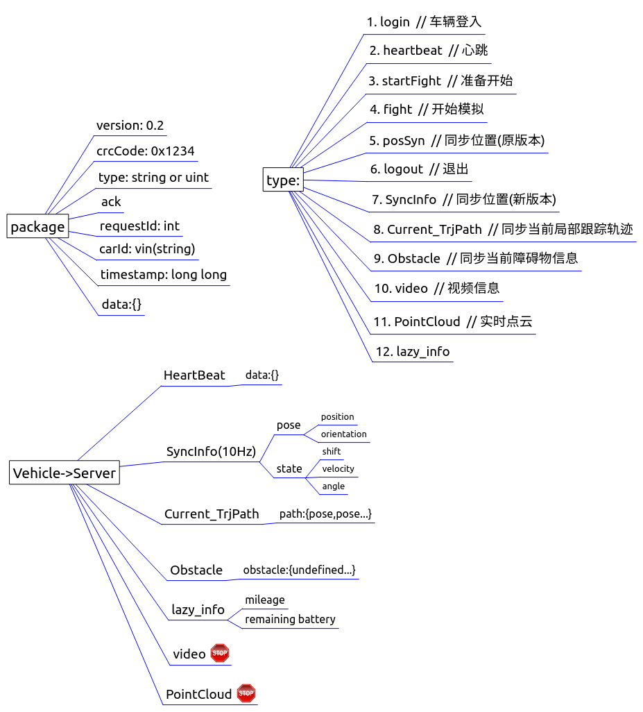

# Monitor-Server V0.2
Monitor-Server of SmartCar, using RVIZ to conduct visualization.

### Protocol
Current Protocol Version is V0.2, as shown below:  

Details could be refered to [vehicle2server_protocol.md](YunleProtocol/vehicle2server.md)

### Feature
> 1. using json format to transport message --for readable
> 2. using twisted-python to conduct async function
> 3. multi-monitor of vehicles is supported
> 4. using rviz to conduct visualization function, both 2D/3D

### Update
> 1. 20190324 add view-tracking function

### TODO
- [ ] Add monitored messages.  
    - [x] Position
    - [ ] Vehicle state: speed/steer/shift
    - [ ] Vechile state: odometry/battery remaining 
- [ ] Test Multi-monitor of vehicles.  
- [ ] Promote visualization functions in RVIZ.  
    - [x] Supprot view tracking of single vehicle.
    - [ ] Add dynamic switch to on/off showing message.

### Attention:
